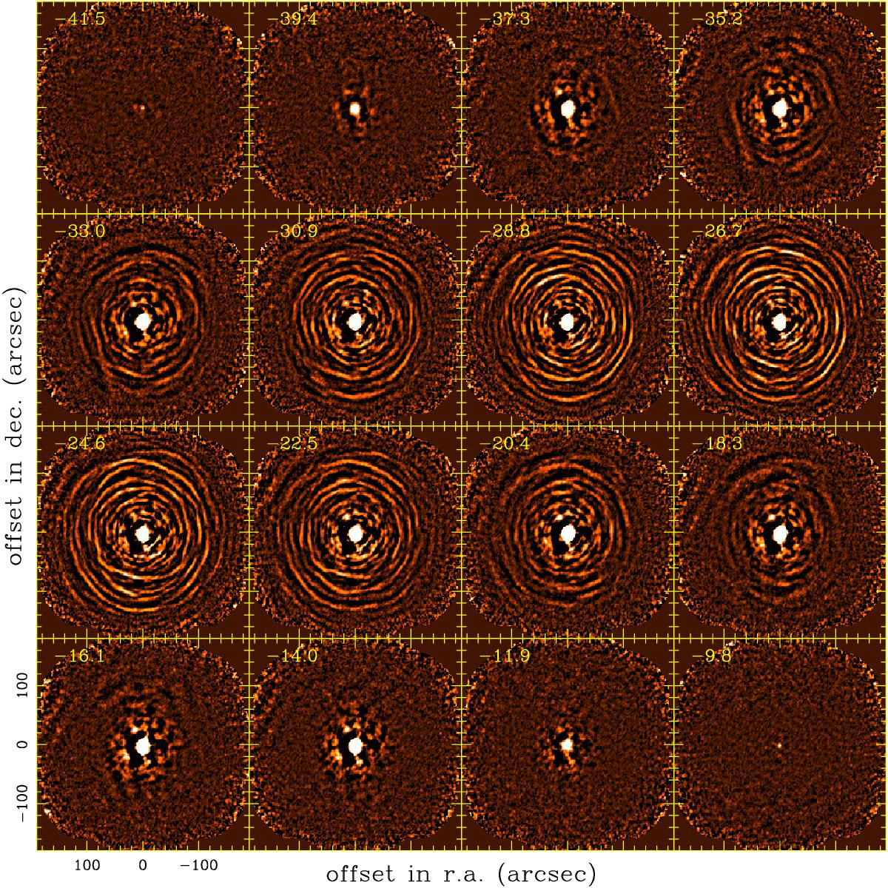
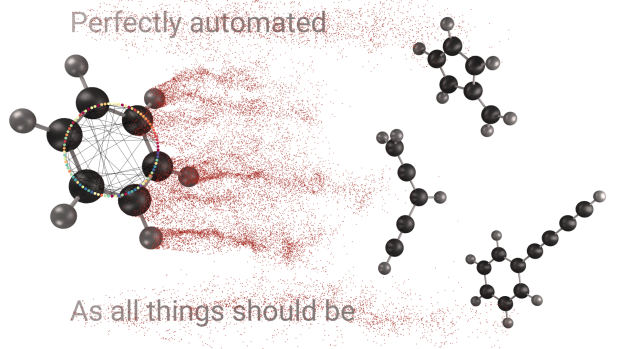

<!-- .slide: data-background-video="figures/RingSpace.mp4" data-background-video-loop="true" -->

# `PySpecTools`

## Pythonic and Deep Learning Workflows for Spectroscopy

### _Kelvin Lee_, Alexander MacLeod, Michael C. McCarthy

<div class="footer">
    
    
</div>

---

<!-- .slide: data-background="https://cdn.eso.org/images/screen/alma-jfs-2010-10.jpg" -->

# Radio Astronomy

- Observations at radio wavelengths ($\lambda$~submm‒metre)
- Transparent to absorption by interstellar dust
- Powerful inteferometry; high bandwidth, spatial, and spectral resolution
- Wide-range of phenomena: hydrogen spin-flip, charged-particles, molecule rotation

<footer>
    <p>Credit: ESO/ALMA/NRAO</p>
</footer>

----

<div class="column">
    <p>Black Hole Imaging</p>
    
    <figcaption>Credit: EHT/NSF/ALMA/SMA/IRAM/JCMT/LMT/SMT</figcaption>
</div>

<div class="column">
    <p>Circumstellar Shells</p>
    
    <figcaption>DOI: <a href="https://www.aanda.org/articles/aa/abs/2018/02/aa31619-17/aa31619-17.html">10.1051/0004-6361/201731619 <a> </figcaption>
</div>

<footer>

<p style="font-size: 1rem">
Astrophysical objects imaged with exquisite detail!
</p>

</footer>

----

# Molecular Astrophysics

<div id="left">

- Molecules reveal physical and chemical properties of space.
    - Gas temperature, density, and velocity
- Microscopic understanding of macroscopic processes;
    - Stellar evolution, planet formation, atmospheres, origins of life
- Insight derived from _known_ molecular identity: assign molecules to observed features
    - Match frequencies with literature data

</div>

<div id="right">

<figure>
    
    <figcaption> <a href="https://ui.adsabs.harvard.edu/abs/2013yCat..35590047B/abstract" <em style="font-size: tiny"> Sgr B2(N) observations with IRAM 30m; Belloche+ 2013</em> </a></figcaption>
</figure>

</div>

----

# Zoom and Enhance

<div id="left">

- Spectroscopic analysis extremely manual and labor intensive
- Hundreds to thousands of spectral features (molecular and interference)
- Difficult to automate, reproduce, and catalog
- Analysis rate incommensurate with data acqusition

<div class="fragment">

<p class="pop">
    Need to improve automation!
</p>

</div>


</div>

<div id="right">


</div>

---

# Enter PySpecTools

<div id="left">


</div>

<div id="right">

Open-source, Pythonic workflow for assigning broadband spectra

<div class="fragment">

1. Familiar abstraction for spectrocopists, chemists, and astronomers

</div>

<div class="fragment">

2. Encourage reproducible and collaborative spectroscopic analysis

</div>

<div class="fragment">

3. Improve information extraction and decision making with deep learning models

</div>

</div>

----

# Typical Workflow


Every step should be reproducible and tracable!

----

# Core Components

<div id="left">

Implementation uses three core abstractions:

1. `AssignmentSession`
    - Metadata, frequency/intensity/automation control
2. `Transition`
    - Representation of spectral features
3. `LineList`
    - Collections of `Transition` objects

</div>

<pre><code class="language-python" style="max-width: 40%">from pyspectools.spectra import assignment

# Load in spectrum and set metadata
session = assignment.AssignmentSession(...)

# Perform preprocessing and peak detection
session.find_peaks(...)

# Load in an external list of frequencies
molecule = assignment.LineList.from_catalog(...)

# Make assignments
session.process_linelist(molecule)

# Generate report
session.finalize_assignments()
</code></pre>

----

# `AssignmentSession`

Object interface for users to load and interact with spectral data

Stores spectra as <a href="https://pandas.pydata.org/">`pandas.DataFrame`</a>: handles parsing, manipulation, and serialization

```python
AssignmentSession.from_csv(...).data
```

Digital signal processing interface with <a href="https://docs.scipy.org/doc/scipy/reference/signal.html">`scipy.signal`</a> and custom window functions:

<pre><code class="language-python">session.apply_filter("hanning")</code></pre>

Baseline and peak detection through custom routines and <a href="https://peakutils.readthedocs.io/en/latest/">`peakutils`</a>:

<pre><code class="language-python"># Find peaks 5 sigma above baseline; use asymmetric least-squares
session.find_peaks(sigma=5., als=True)
</code></pre>

Interactive viewing within notebook environments with <a href="https://plotly.com/">Plotly</a>:

<pre><code class="language-python">session.plot_spectrum()
</code></pre>

Serialize session with <a href="https://joblib.readthedocs.io/en/latest/persistence.html">`joblib` pickle</a>:

<pre><code class="language-python">session.save_session()
</code></pre>

----

# `Transition`

Low level representation of any spectral feature, used to track peaks in `AssignmentSession` and entries in `LineList`.

Stores (meta)data as object attributes:

1. Line frequency/intensity
2. Source (which experiment/observation/catalog/publication?)
3. ID number
4. Identification flag

<div class="fragment">

If molecular,

1. Name/formula/SMILES
2. Quantum numbers, state energies

</div>

----

# `LineList`

Collection of `Transition` objects originating from a single source.

Creation from a variety of different standard sources:

<pre><code class="language-python">molecule = LineList.from_catalog(...)
# Online database through `astroquery` API
molecule = LineList.from_splatalogue_query(...)
molecule = LineList.from_dataframe(...)
molecule = LineList.from_pgopher(...)
</code></pre>

Make assignments using a single `LineList`:

<pre><code class="language-python">session.process_linelist(molecule)
</code></pre>

Or automate creation and assignment with YAML:
<pre><code class="language-yaml">formaldehyde:
    formula: h2co
    filepath: catalogs/v0_h2co.cat
    source: muller_2017
    smiles: C=O
</code></pre>

<pre><code class="language-python">session.process_linelist_batch("batch_catalog.yml")
</code></pre>

----

# `PySpecTools` workflow

Modular/pipeline analysis; separate analysis into multiple scripts/notebooks centred around serialized `AssignmentSession`

`01-spectral_processing.py` — Filter data, serialize `AssignmentSession`

`02-assignments.py` — Load `AssignmentSession`, create `LineList`s, and make peak assignments

<hr>

`03-spectrum_overview.py` — Static figure generation for publication

`04-abundances.py` — Additional line profile analysis

<hr>

<div class="fragment">

Additional script to finalize data products:

`xx-export_data.py` — Generate LaTeX tables, reports, and export CSVs

</div>

<div class="fragment">

<a href="https://">Easy packaging for sharing on platforms like Zenodo</a>

</div>

----

# Automated report generation

Uses `jinja` for templating, `plotly` for interactive plots, and `DataTables` for interactive tables; all with `session.finalize_session()`!

<embed type="text/html" src="data/5000-summary.html" style="width: 80%" height=600 class="inverted">

Easy collaborative analysis: everyone has a browser, not everyone knows Python!

----


# Products with `PySpecTools`

Used extensively in laboratory analogues of interstellar chemistry:

<div id="left">

<figure>



</figure>

</div>

<div id="right">

<a href="https://pubs.acs.org/doi/10.1021/acs.jpclett.9b00586">Study of Benzene Fragmentation, Isomerization, and Growth</a> 

Lee & McCarthy, <em> J. Phys. Chem. Lett.</em> 2019

<a href="https://pubs.acs.org/doi/abs/10.1021/acs.jpca.0c02919">Exhaustive Product Analysis of Three Benzene Discharges</a>

McCarthy _et al._, _J. Phys. Chem. A._ 2020

__Over two hundred new molecules discovered in the last year!__

<a href="https://zenodo.org/record/3739468" class="pop"> Version tracking with Zenodo with citable DOI </a>

</div>

---

# Deep Learning in Spectroscopy

`PySpecTools` provides tools for identifiable signals—what about unknown ones?

1. Which features belong to a common carrier?
2. What is the molecular identity of the signal?

<div class="fragment">

<p class="pop" style="max-width: 60%">Probabilistic deep learning models can help supplement human analysis</p>

</div>

----

# Probabilistic deep learning

<div id="left">

Deep neural networks as universal function approximators

Deterministic model provide maximum likelihood estimate; maybe not the most appropriate

<div class="fragment">

Probabilistic models return a _distribution_ of possible answers weighted by likelihood

Uncertainty crucial for decision making and information extraction

</div>

<div class="fragment">

<hr>

_How likely is my molecule A, instead of B?_

_How likely does a set of frequencies belong to one molecule?_

</div>

</div>

<div id="right">


</div>

----

# Deep learning models

Development, training, and interfacing with PyTorch

- Deep learning framework with Pythonic abstraction
- High-level interface for CPU/CUDA code

<div class="fragment">

Training performed with Nvidia GV100 GPUs on the <a href="https://doi.org/10.25572/SIHPC">Hydra computing cluster at the Smithsonian Institution</a>.

Pre-trained model weights, code, and interface implemented in `PySpecTools`: no expertise of deep learning required!

</div>

----

# Spectroscopic Models

Spectral features correspond to transitions between quantum mechanical states represented by a Hamiltonian

<div id="left">

The encoder model learns to compress information about a sequence of frequencies-like parameters of a Hamiltonian ($z$)

$$ z \vert \nu_n, \nu_{n-1},\ldots $$

we refer to $z$ as an "encoding"/"embedding" vector.

LSTM model learns to produce useful embeddings by training a classifier to predict $a,b,c$-type spectra as softmax likelihoods:

$$ \mathrm{softmax(x)} = \frac{\exp(x)}{\sum \exp(x)} $$

</div>

<div id="right">


</div>

----

# Identifying new molecules


----

# Future directions

- Pre-assignment performed by reinforcement learning
    - Deep Q learning with spectroscopic autoencoder

- Extension to other wavelengths

---

# Ackowledgements

<div class="l-multiple">
    <div class="img-frame">
        
        <span>80NSSC18K0396</span>
    </div>
    <div class="img-frame">
        
        <span>AST-1908576</span>
    </div>
</div>

<hr style="margin: 30px">


<div style="align-content: center; padding-top: 100px">

<a class="pop" style="width: 60%">
The entire open-source community!
</a>

</div>

---

<!-- .slide: data-background-video="figures/RingSpace.mp4" data-background-video-loop="true" -->

<div class="grid sidebar">
    <h1> Thank you! </h1>
</div>

<div class="l-multiple">
    <div class="img-frame">
        
        <span>@cmmmsubmm</span>
    </div>
    <div class="img-frame">
        
        <span>laserkelvin.github.io</span>
    </div>
    <div class="img-frame">
      
      <span>@laserkelvin</span>
    </div>
</div>

<footer>

Copyright © 2020 Kelvin Lee

</footer>